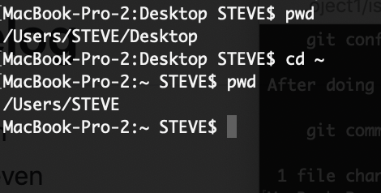
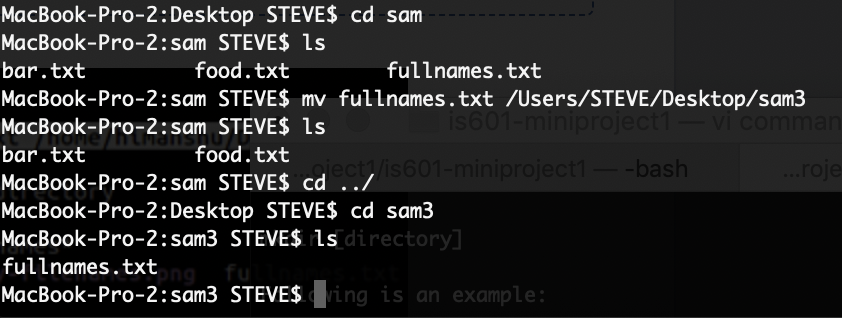
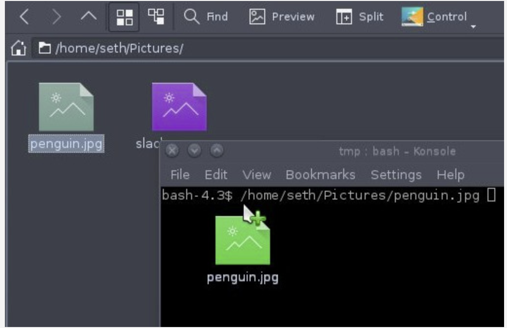

Introduction: Basic Linux Commands 

## cd:
 
### In simple Terms:
The cd command changes your current directory. In other words, it moves you to a new place in the filesystem.

## Some Detail:
If you are changing to a directory that is within your current directory, you can simply type cd and the name of the other directory.

cd work

If you are changing to a directory elsewhere within the filesystem directory tree, provide the path to the directory with a leading /.

cd /usr/local/bin

To quickly return to your home directory, use the ~ (tilde) character as the directory name.

cd ~

## mkdir

### In simple Terms:

Definition: The mkdir command allows the user to create directories. This command can create multiple directories at once as well as set the permissions for the directories. It is important to note that the user executing this command must have enough permissions to create a directory in the parent directory, or he/she may recieve a ‘permission denied’ error.
  
### Some Detail:

**mkdir--version** It displays the version number, some information regarding the license and exits.  

**mkdir -v** It displays a message for every directory created.

**mkdir -help** It displays the help related information and exits.

**mkdir-m a=rwx [directory]** This option is used to set the file modes, i.e. permissions, etc. for the created directories. The syntax of the mode is the same as the chmod command.

## How to create directories using mkdir?

Creating directories is pretty simple, all you need to do is to pass the name of the directory you want to create to the mkdir command.

mkdir [directory]

Following is an example:

mkdir test 

## cp

### In simple Terms:

The `cp` command is a command-line utility for copying files and directories. It supports moving one or more files or folders with options for taking backups and preserving attributes.

To copy a file with the `cp` command pass the name of the file to be copied and then the destination. In the following example the file `food.txt` is copied to a new file called `bar.txt`. The cp command will also create the new file as part of the operation.

ls 
food.txt 
cp food.txt bar.txt
ls 
food.txt bar.txt

Copy 2 files main.c and def.h to destination absolute path directory /home/usr/rapid/ 

cp main.c def. h /home/usr/rapid/

## pwd

### In simple Terms:

**pwd** stands for **P**rint **W**orking **D**irectory. It prints the path of the working directory, starting from the root.

pwd is shell built-in command(pwd)

This command has two flgas. 

**pwd - L**  Prints the symbolic path.

**pwd - P** Prints the actual path. 

## mv

### In simple Terms:

The `mv` command is a command-line utility for moving and renaming files.

If you want to just rename a file, you can use the mv command in the following way:

mv [filename]  [new_filename] 

For  mv names.txt fullnames.txt 

Similarly, if the requirement is to move a file to a new location, use the mv command in the following way:

mv [filename] [dest-dir]

For example: 

mv fullnames.txt /Users/STEVE/Desktop/sam3

## rm

### In simple Terms:
rm stands for **remove** here. rm command is used to remove objects such as files, directories, symbolic links and so on from the file system like UNIX.

This command normally works silently and you should be very careful while running **rm** command because once you delete the files then you are not able to recover the contents of files and directories.

For example rm fullnames.txt 

## history

### In simple Terms:

The `history` command shows a list of the commands entered since you started the session. The joy of `history` is that now you can replay any of them by using a command such as:

The `!497` command at the prompt tells the shell to rerun the command on line 497 of the history list. I could also access that command by entering:

## home directory and ~

### In simple Terms:

The tilde (~) symbol stands for your home directory. 

For example To navigate to your home directory, use **"cd"** or **"cd ~"**

## file paths in linux

### In simple Terms:

A file path is the human-readable representation of a file or folder’s location on a computer system.

Examples: 

Files and folders on Linux are given names containing the usual components like the letters, numbers, and other characters on a keyboard. But when a file is inside a folder, or a folder is inside another folder, the **/** character shows the relationship between them. That’s why you often see files listed in the format **/usr/bin/python3** or **/etc/os-release**. The forward slashes indicate that one item is stored inside of the item preceding it.

System can be expressed as a path. If I have the file  **penguin.jpg**  in the  **Pictures**  folder within my home directory, and my username is  **seth**, then the file path can be expressed as  **/home/seth/Pictures/penguin.jpg**.

Most users interact primarily with their home directory, so the tilde (**~**) character is used as a shorthand. That fact means that I can express my example penguin picture as either  **/home/seth/Pictures/penguin.jpg**  or as  **~/Pictures/penguin.jpg**.

## Use Tab Key to complete file paths

### In simple Terms:

Tab completion is an extremely helpful feature in nearly any command-line environment, whether you’re using the Bash shell on Linux, Command Prompt or PowerShell on Windows, or a terminal window on Mac OS X.

This feature can dramatically help you speed up typing commands. Just hit Tab while typing a command, option, or file name and the shell environment will automatically complete what you’re typing or suggest options to you.

Type sa, then tab twice list of files beginning with sa

## Use up and down arrow for history

### In simple Terms:

Using the command history

Use the up and down key's to scroll  through previously typed commands. Press [Enter] to execute  them or use the left and right arrow  keys to edit  the command first.

# Changelog

- [x] cd ~ Steven 
- [x] mkdir ~ Steven 
- [x] cp ~Steven 
- [x] pwd ~ Steven
- [x] mv ~ Steven  
- [x] rm ~ Steven
- [x] history ~ Steven
- [x] Home directory and ~   Steven
- [x] file paths in linux  ~ Steven
- [x] Using the tab key to complete file paths  ~ Steven
- [x] Using up and down arrow for history

