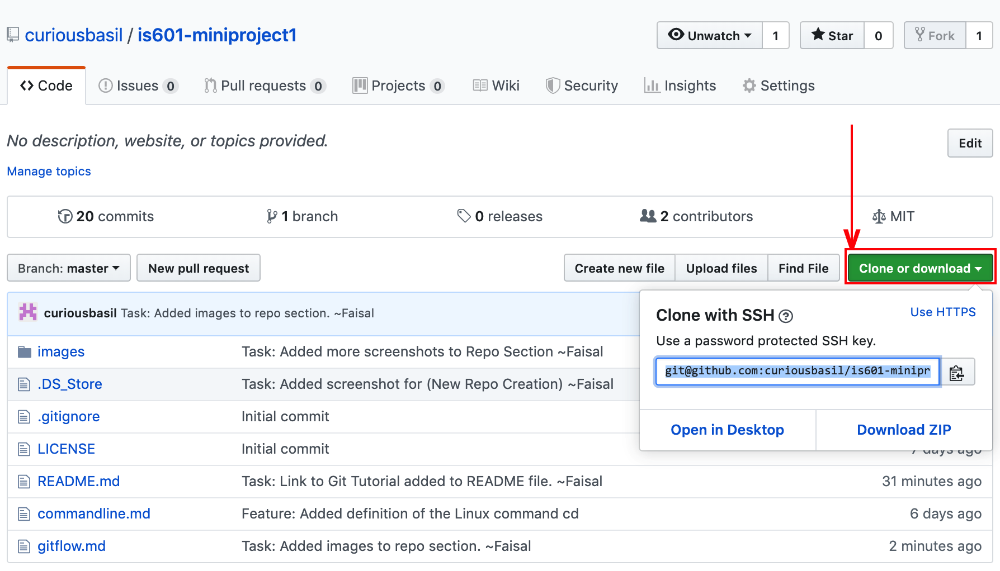
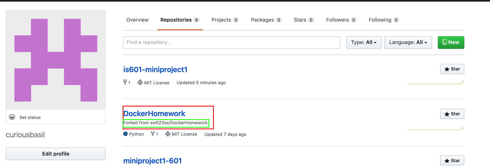
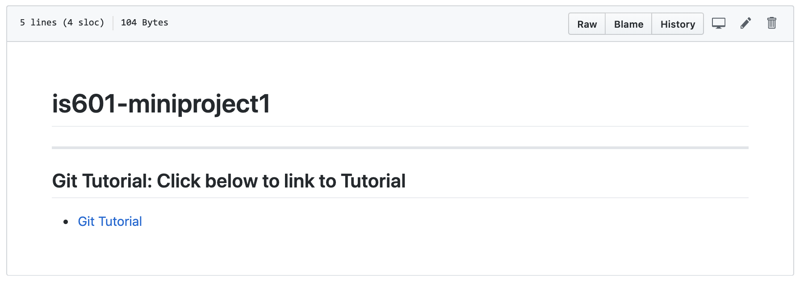
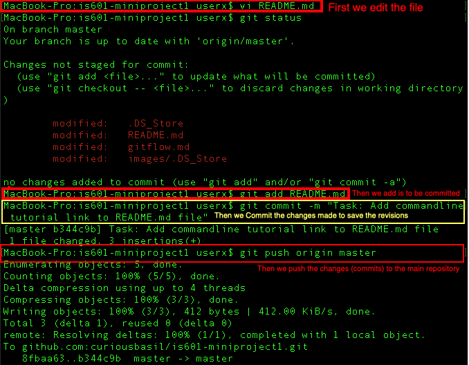
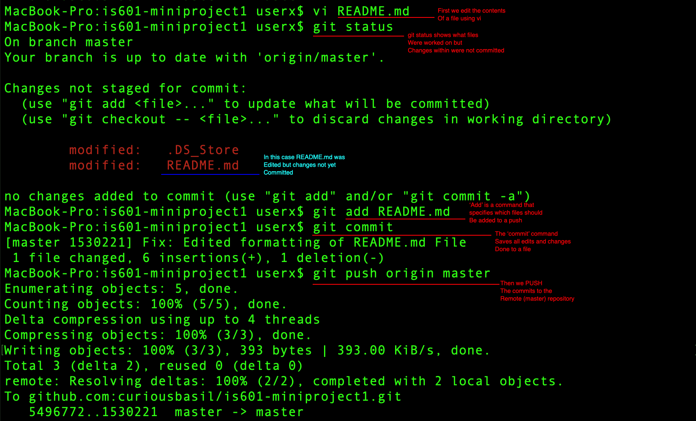
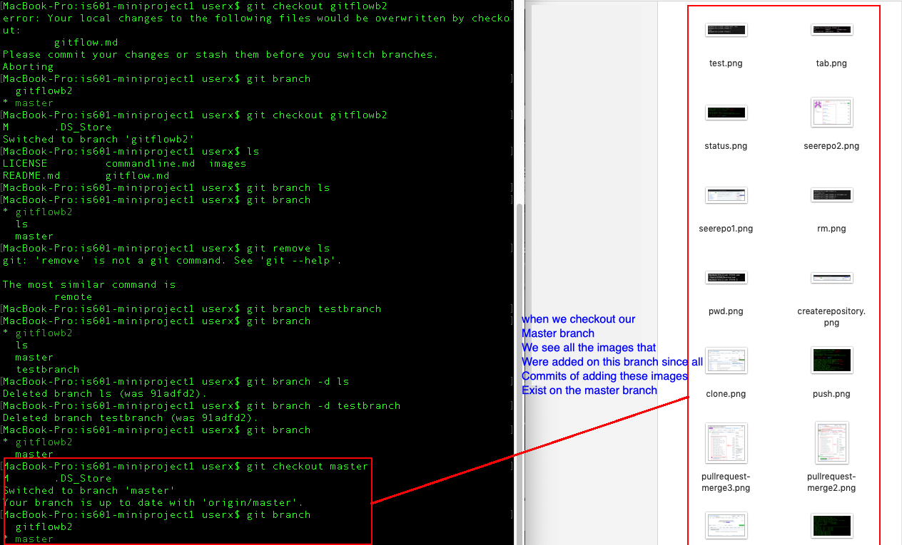

Git Tutorial 101 : Concepts and Definitions
---

##Gitflow Workflow: Definition

Gitflow is the end-to-end branching method used for development on *github*.

*Here's How it Works*

Say a development team wishes to start a new project. They would roughly follow the steps shown below which would reflect a gitflow workflow:

* A project leader or repository manager would create a master repository
* Every developer on the team would clone this repository on their local repos
* From there every developer would create and work on their development branches
* They would then branch off to work feature branches
* Once those features and fixes are complete, they would merge the work done back to their development branch
* Developers would go between the last two steps until the release. 
* Here they would create a release branch and fix bugs. This would be considered the testing environment
* If developers need to work on features they would branch off and merge back into the release branch
* Once testing in the release branch is complete, developers would merge any work done on the latest development branch, then merge back into the master branch. 
* If there are any bugs, the latest master branch would be branched into a *hotfixes* branch
* Developers would go repeat the steps until a project is complete.

*The gitflow workflow has many benifits. Here are some of the main ones:*
* It allows developers to work in parallel to each other
* It also allows developers to develop parallel branches to each other so that the work done on their main local branch isn't affected by any wrong updates to the file
* It allows for easy collaboration between team members. 
* Since there would be a repository manager, it will allow for version/quality control. Where the repo manager would check the work before merging it into the master branch. 
* It allows for easy and quick fixes. Mistakes are usually easily noticed and realized. So the developers would go back and fix it.
* It gives developers an area to stage all completed commits to then test it without realsing and merging it to the master branch,
 

---

## Repository:
 
### In simple Terms:

A Repository is a folder that holds All files of a specific project on Github.
 
### Some Detail:

The Person that created the repository can share the URL with others who will also be working on this project. From there, members can clone a repository and save is on their local computer to start working on developing the project and add their part to it as designated by the team leader.

### To visualize:

Creating a new Repository

To See List of Repositories

---

## Clone: 

### In simple Terms:

Cloning makes a copy of a repository on Github on a local computer.

### Some Detail:

When a Team member working on a project is designated some work on it, they will make a copy of the repository on their local computer to work on developing the project by using the clone command.

### To visualize:

To clone a repository, we go to the repository page and click on the Green Clone button as shown below. This can be done Via HTTPS or SSH

---

## Fork:

### In Simple Terms:
Forking is making a copy of a master repository in your github account.

### Some Detail:

When a team is working on a project and a team member wishes to create a copy of a master repository into their repository, they would Fork it into their repository to start working on the project

### To visualize: 

When you are at a repository that you did not create and wish to create a copy of that repository on to your github account, you click on the fork option on the upper right of the page as shown below.

Once a repository is forked, a copy will be saved into your repository as shown below.

---
## Branch:

### In Simple Terms:

Branching is when a  new branch is created from the main line to continue to develop a project without changing the main.

### Some Detail:

When a developer is working on a project and wishes to add a fix, a task or a feature to a project without changing the main project files. It allows a developed to work on a projects master branch and a 2nd branch (or more) in parallel so that the work on a 2nd branch doesn't affect the work on the master branch.

### To Visualize:

Below is a screenshot from the terminal window. It shows that typing "git branch <name>" creates a new branch off the master branch. Typing "git checkout <name>" moves us from working on a master branch to the branch sepcified in the command line and typing only "git branch" Shows us what branch we are currently on. Any changes in the specified branch will NOT affect the master branch until the developer merges his branches together. Like this, a developer can work on multiple versions of a project in parallel without comprimising the original work on the master.

---

## Commit:

### In Simple Terms:

Committing is a command that saves all edits and changes done to a project
 file .

### Some Detail:

When a developer is working on a project and wishes to save the revisions that were added into the project before pushing it to the main repositoy they enter a commit command to essentially save all the changes done to the branch they are working on.

### To visualize: 

Below is a rendering of a README.md file on github before any changes

Here are some edits made to the README.md file

Once the edits are made, the file must be added 'git add <filename>', then committed 'git commit' to be uploaded into the master repository.

Once the changes are pushed, it will render as shown below on github.

---

## Merge:

### In Simple Terms:

Merging is taking the work of 2 or more developers working on a specific project, and putting them together to update and add on to the master repository.

### Some Detail:

When 2 or more developers are working on specific tasks, features and/or fixes on a designated project they will work on it locally. When they are ready to commit and push this commit to be reflected onto the master repository, they push the updates onto their repository which is a clone or a fork of the master, then request what is called a pull request. From there the project manager (person who is managing the master repository) will check the work, accept the revisions and **MERGE** the work of the developer to the main repository.

### To Visualize:

Here we see that user *sw523ss* had requested a pull which the manager of the master repository *curiousbasil* will have to check, accept then merge

This shows a pull request page which is still pending approval to merge:

This Shows a pull request page after merge is approved:

---

## Checkout:

### In Simple Terms:

Checkout is a command that allows the user (developer) switch between branches in a project on git.

### Some Detail:

Let's say a developer is working on the master branch of a project but wishes to create a new branch to start working on a feature, fix or a task in parallel to the master branch. Lets say they decide to name the new branch '2ndbranch'. If they are are on the master branch and they type "git checkout 2ndbranch" in the command line this command will switch the user from working on the master branch to this 2nd branch.

### To visualize:

In the image below we created a new branch from the master branch and named it "gitflowb2". Then, in order to know what branch we are on we type the command "git branch". This shows us that we are on the master branch. In order to switch from working on the master branch to work on "gitflowb2" we type the command (git checkout <destinaion branch name>) in this case "git checkout gitflowb2". Then, when we want to check which branch we're on we type "git branch" and it shows that we were moved to the 2nd branch.

---

## Push:

### In Simple Terms:

Pushing is when committed content is uploaded into the master repository.

### Some Detail:

When a developer is working on a project completes tasks, features and/or fixes and commits them, they would then **Push** the contents into the master repository on github.

### To Visualize:

Below we see a terminal where the developer edited a file named "README.md" using the 'vi' command. Once the changes are made, the command 'git status' shows all the files that were worked on but which changes were not 'committed' yet. These are shown below as modified files. Before a file can be pushed (uploaded) into the master (remote) repository, the files must be specified using *add* then changes saved using *commit*. After this, the files are pushed. In the below example the command "git push origin master" is used which uploads the changes on a file to the master repository

---
## Pull:

### In Simple Terms:

The pull command downloads content from a remote (master) repository and downloads it into a local repositor.

### Some Detail:

Let's give an example of two or more developers that are working on a project and each has a copy of a repository locally. When they each work on their designated tasks and they add, commit and push back into the master (remote repository) the repository manager will merge all these commits into the master repo. At this point in time, each developer will have a different version of the repository on their local repo. So before they continue work, and to ensure that all the developers are starting again from the same point (Version), they need to pull from the master repo. This way they will all have the most updated version of the repo on their local.

### To Visualize:

The command "git pull origin master" will pull the version of the master repo (remote) into the local repository.

 
---

## Remote Add / Remove / Show:

### In Simple Terms:

**Remote add** is to add a remote repository to a local repository which basically links your local repository to a github repo.

**Remote Remove** is the opposite of the above. Basically it disconnects the link between your local repository and the online github repo.

**Remote show** is a command that shows information about the remote repository. 

### Some Detail:
If a developer wishes to connect/link his local repository to a remote master repository they can use the *remote add* to do so and *remote remove* to disconnect that link.The command *git remote show <remotename>* would show important information about the remote repository which can help identify the name , the branch, some basic configuration info abot the remote repo.

### To Visualize: 
The Screenshot below shows the result of the command *git remote show origin*

---

## Status:

### In Simple Terms:

The command 'git status' shows the changes that have been made in the files in that directory. 

### Some Detail:

Say a developer is working on editing a file or more in a directory. Once they are done with their work on these files, they wish to know which files were worked on and that the changes have not yet been committed. So a Simple 'git status' command will show them a list of these files.

### To Visualize:

---

## Master Branch:

### In Simple Terms:

A Master Branch is the main branch in a project which other branches are created from. 

### Some Detail:
When a developer is working on a project on the master branch and wishes to add some new code without changing the master code they would create a new branch from the master branch. This ensures the developer that no matter what changes are made would not affect the master branch. If the work they did was successful, they would then merge the branch with the master branch and commit to take the work from both branches INTO the master branch making it a part of the original content in the master branch. The master branch is considered the default branch in a project.

### To Visualize:

In this example we are assuming that most of the work is being done on the master branch.
In the first screenshot we can see that while on a master branch, all images added to this project shows on the master since all the commits to add these images exist on the master branch

In the screenshot below we transfer to the branch *gitflowb2*, and this will show us only the images added and committed by the time *gitflowb2* was created

---

# Changelog

- [x] Repository ~ Faisal
- [x] Clone ~ Faisal
- [x] Fork ~Faisal
- [x] Branch ~Faisal
- [x] Commit ~Faisal
- [x] Merge ~Faisal
- [x] Checkout ~Faisal
- [x] Push ~Faisal
- [x] Pull ~Faisal
- [x] Remote Add / Remove / Show ~Faisal
- [x] Status ~Faisal
- [x] Master Branch ~Faisal

