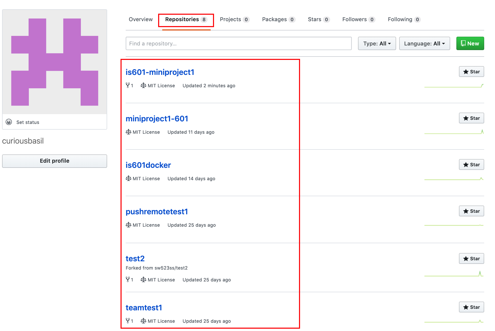
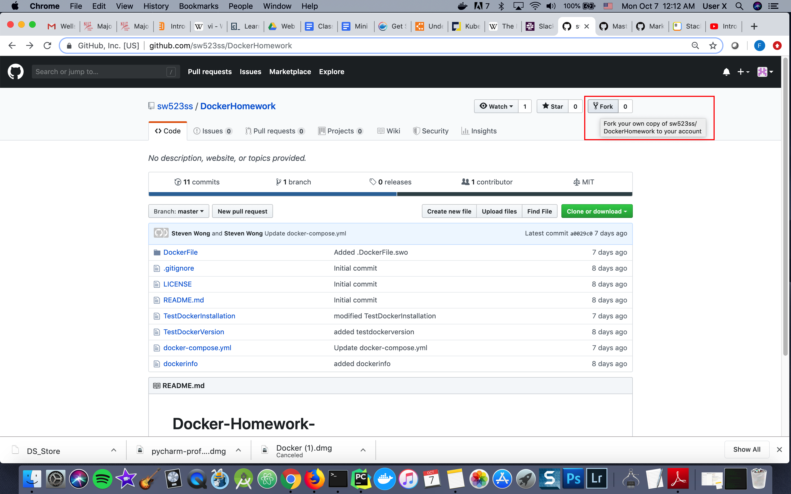
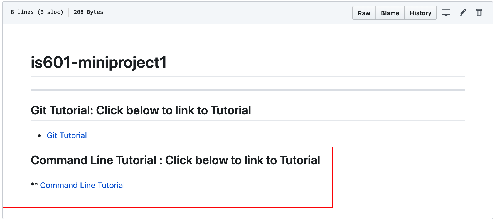
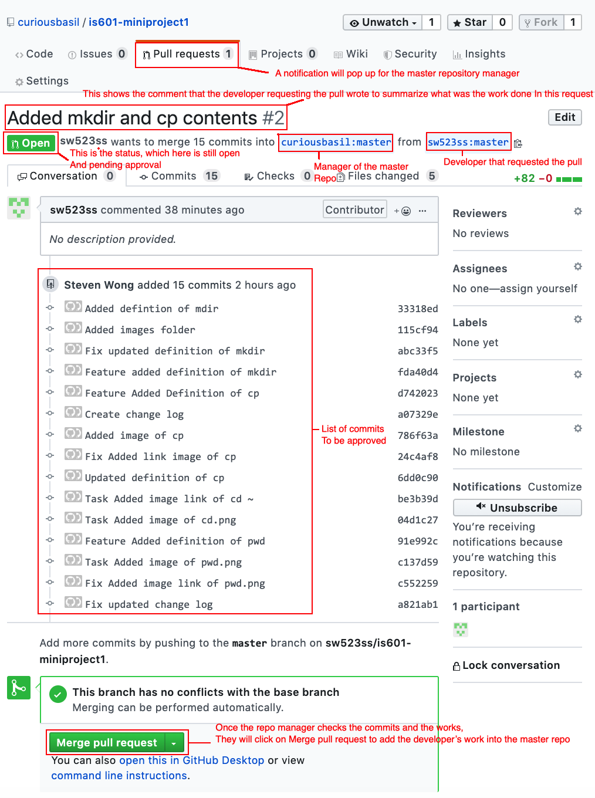
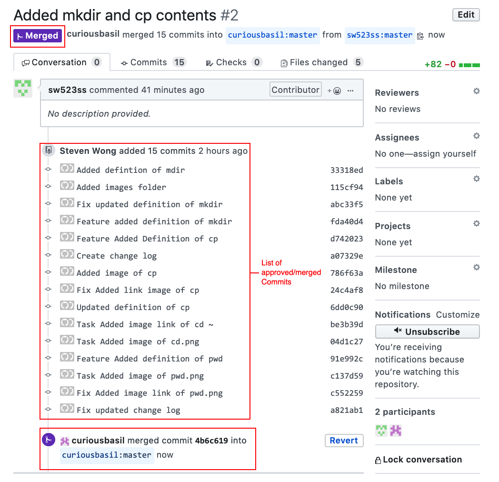

Git Tutorial 101 : Concepts and Definitions
---
## Repository:
 
### In simple Terms:

A Repository is a folder that holds All files of a specific project on Github.
 
### Some Detail:

The Person that created the repository can share the URL with others who will also be working on this project. From there, members can clone a repository and save is on their local computer to start working on developing the project and add their part to it as designated by the team leader.

### To visualize:
Creating a new Repository

To See List of Repositories

---

## Clone: 

### In simple Terms:

Cloning makes a copy of a repository on Github on a local computer.

### Some Detail:

When a Team member working on a project is designated some work on it, they will make a copy of the repository on their local computer to work on developing the project by using the clone command.

### To visualize:

To clone a repository, we go to the repository page and click on the Green Clone button as shown below. This can be done Via HTTPS or SSH

---

## Fork:

### In Simple Terms:
Forking is making a copy of a master repository in your github account.

### Some Detail:

When a team is working on a project and a team member wishes to create a copy of a master repository into their repository, they would Fork it into their repository to start working on the project

### To visualize: 
When you are at a repository that you did not create and wish to create a copy of that repository on to your github account, you click on the fork option on the upper right of the page as shown below.

Once a repository is forked, a copy will be saved into your repository as shown below.

---
## Branch:

### In Simple Terms:
Branching is when a  new branch is created from the main line to continue to develop a project without changing the main.

### Some Detail:
When a developer is working on a project and wishes to add a fix, a task or a feature to a project without changing the main project files. It allows a developed to work on a projects master branch and a 2nd branch (or more) in parallel so that the work on a 2nd branch doesn't affect the work on the master branch.

### To Visualize:

Below is a screenshot from the terminal window. It shows that typing "git branch <name>" creates a new branch off the master branch. Typing "git checkout <name>" moves us from working on a master branch to the branch sepcified in the command line and typing only "git branch" Shows us what branch we are currently on. Any changes in the specified branch will NOT affect the master branch until the developer merges his branches together. Like this, a developer can work on multiple versions of a project in parallel without comprimising the original work on the master.

---

## Commit:

### In Simple Terms:
Committing is a command that saves all edits and changes done to a project
 file .

### Some Detail:
When a developer is working on a project and wishes to save the revisions that were added into the project before pushing it to the main repositoy they enter a commit command to essentially save all the changes done to the branch they are working on.

### To visualize: 
Below is a rendering of a README.md file on github before any changes

Here are some edits made to the README.md file

Once the edits are made, the file must be added 'git add <filename>', then committed 'git commit' to be uploaded into the master repository.

Once the changes are pushed, it will render as shown below on github.

---

## Merge:

### In Simple Terms:
Merging is taking the work of 2 or more developers working on a specific project, and putting them together to update and add on to the master repository.

### Some Detail:
When 2 or more developers are working on specific tasks, features and/or fixes on a designated project they will work on it locally. When they are ready to commit and push this commit to be reflected onto the master repository, they push the updates onto their repository which is a clone or a fork of the master, then request what is called a pull request. From there the project manager (person who is managing the master repository) will check the work, accept the revisions and **MERGE** the work of the developer to the main repository.

### To Visualize:

Here we see that user *sw523ss* had requested a pull which the manager of the master repository *curiousbasil* will have to check, accept then merge

This shows a pull request page which is still pending approval to merge:

This Shows a pull request page after merge is approved:

---

## Checkout:

### In Simple Terms:

### Some Detail:

---

## Push:

### In Simple Terms:

### Some Detail:

---
## Pull:

### In Simple Terms:

### Some Detail:

---

## Remote Add / Remove / Show:

### In Simple Terms:

### Some Detail:

---

## Status:

### In Simple Terms:

### Some Detail:

---

## Master Branch:

### In Simple Terms:

### Some Detail:

---
---
# Changelog

- [x] Repository ~ Faisal
- [x] Clone ~ Faisal
- [x] Fork ~Faisal
- [x] Branch
- [x] Commit
- [ ] Merge
- [ ] Checkout
- [ ] Push
- [ ] Pull
- [ ] Remote Add / Remove / Show
- [ ] Status
- [ ] Master Branch

