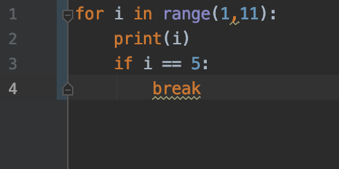
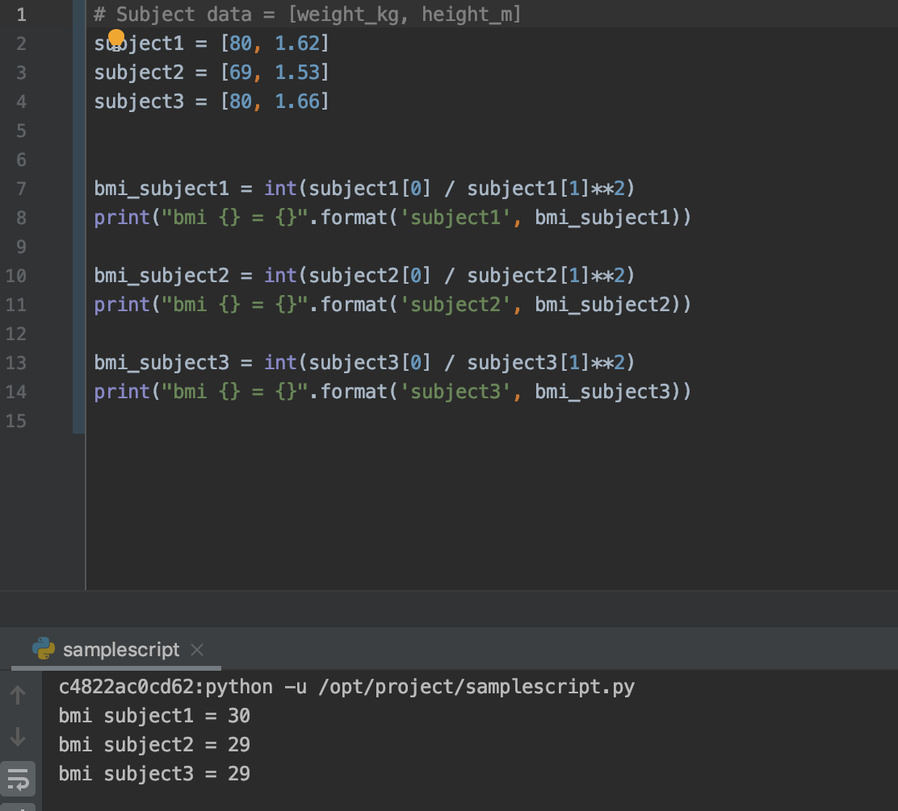
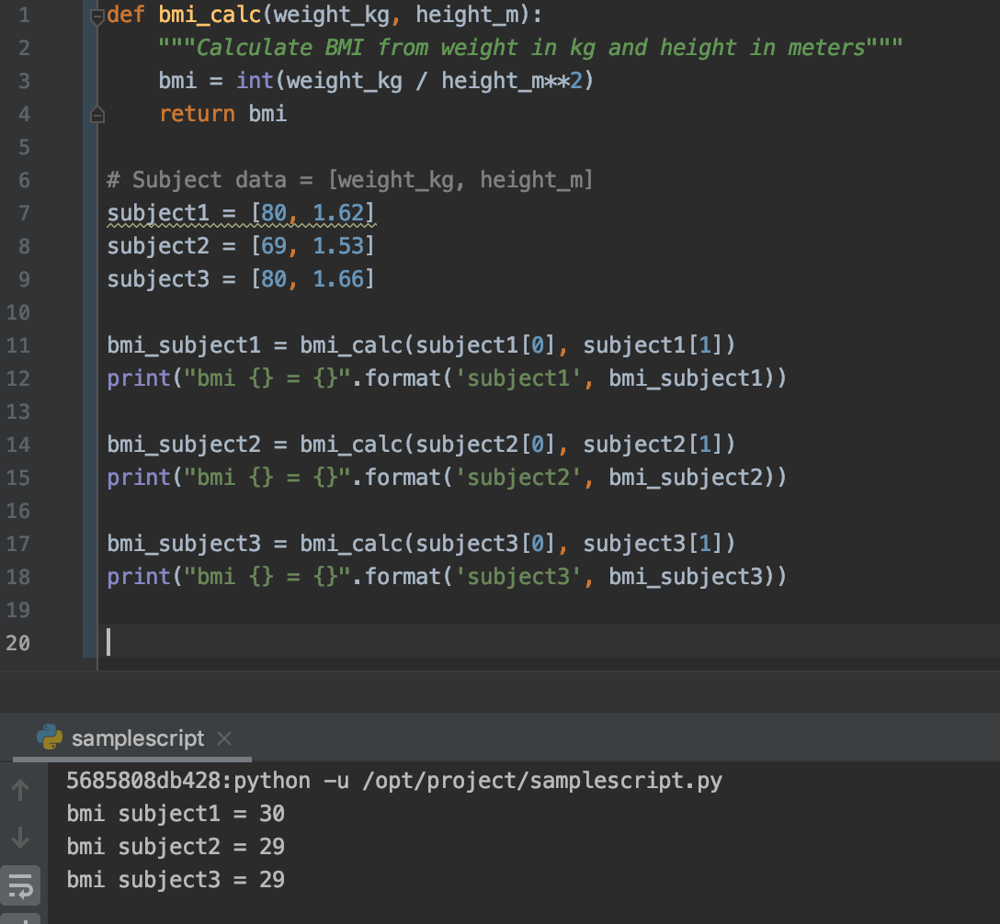
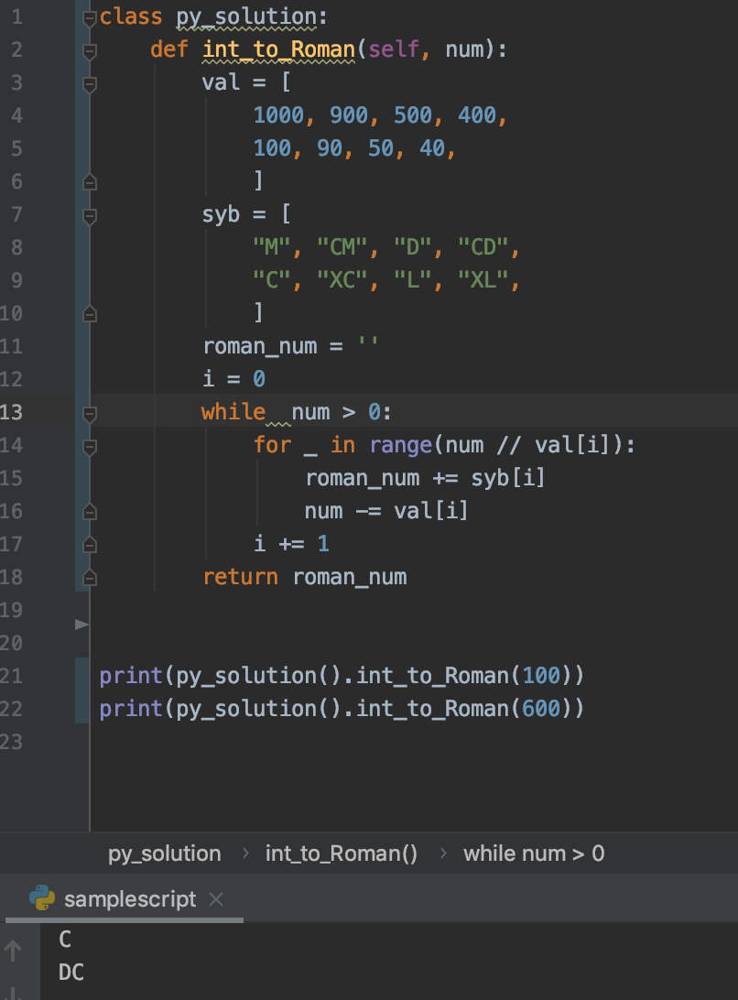
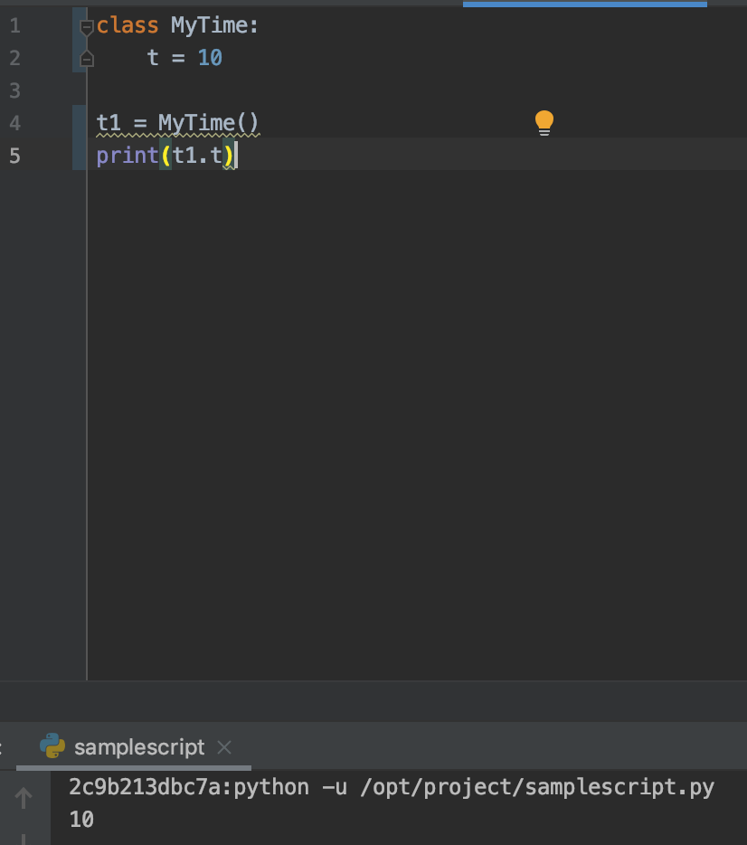
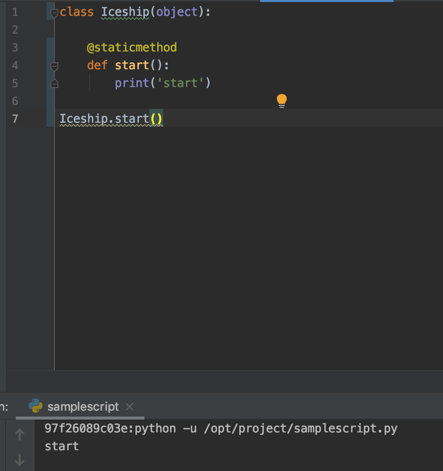
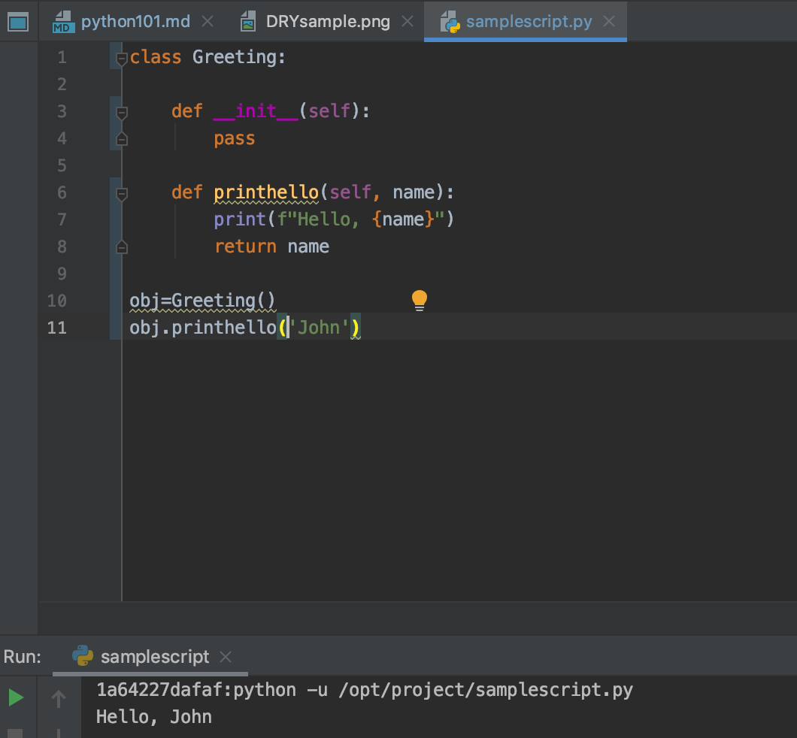
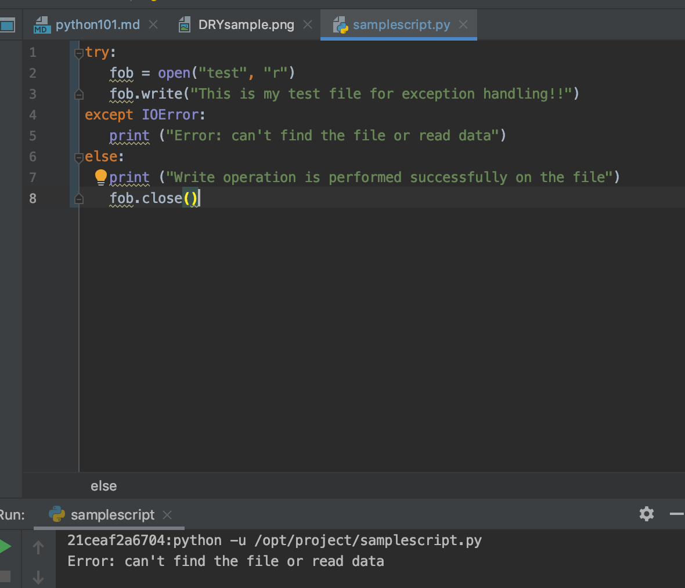
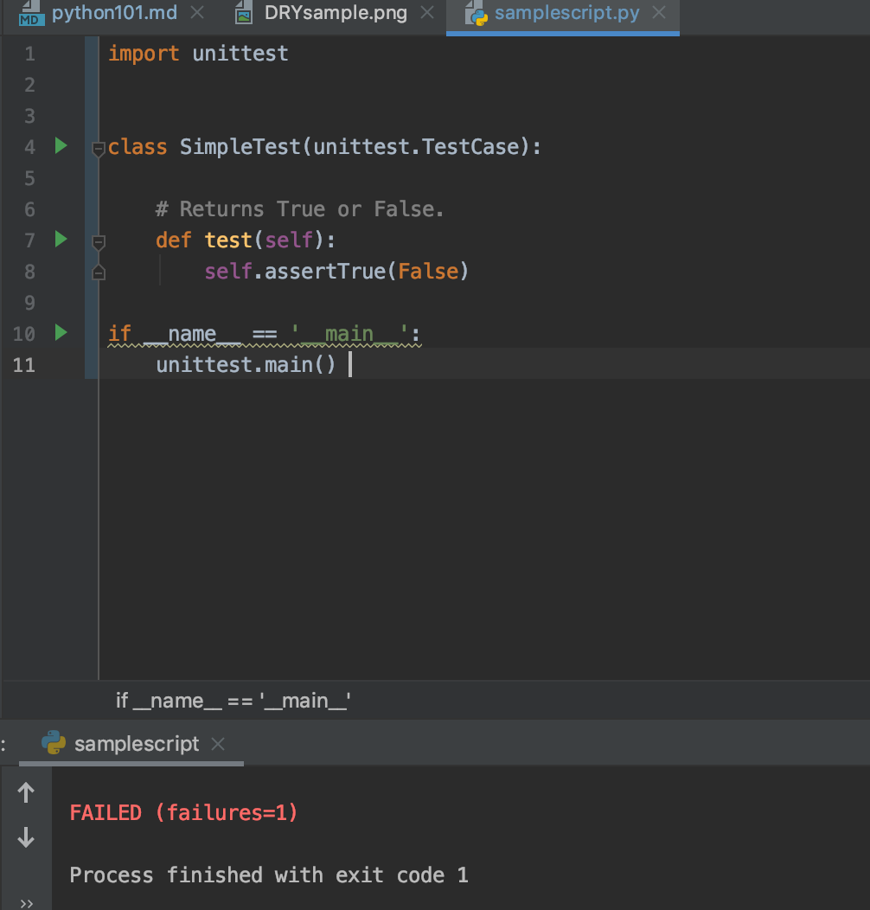
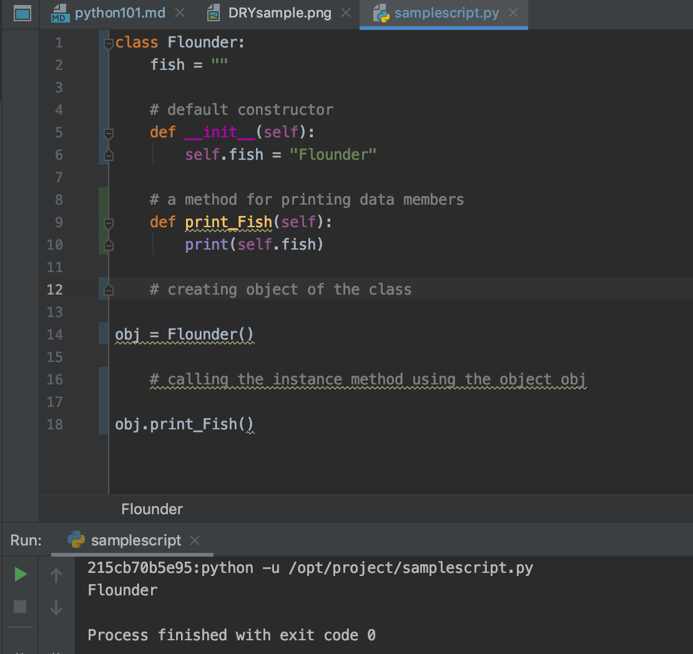

# Python 101: Definitions, Concepts and Examples

## How Python uses Indentation to control Flow

### In simple Terms:

Python uses indentation to control flow by defining a block of code. 

### Some Detail:

A code block starts with indentation and ends with the first unindented line. 
The amount of indentation must be consistent throughout that block. For instance, four whitespaces are used for indentation. 

### To visualize:

---

## Don't Repeat Yourself

### In simple Terms:

The Don't Repeat Yourself principle states that duplication in logic should be eliminated via abstraction. 

### Some Detail:

Adding unnecessary code increases the amount of work required to maintain the software in the future. Duplicate code adds to technical debt. 
Duplication decreases the quality of the code. 

### To visualize:

Calculate BMI for three subjects. 

Use function to avoid repeating. 

---
## Design Patterns from Gang of Four

### In simple Terms:

Programmers faced with a number of recurring problems as they write object oriented code. To standardize the solutions to these problems, four software engineers, identified the most common patterns of problems that occur in object oriented programming. They formulated model solutions to these common problems in a book called “Design Patterns: Elements of Reusable Object-Oriented Software” aka “The Gang of Four (GoF)

### Some Detail:

### Classification of Design Patterns

**Creational Patterns**: These are concerned with creating objects.

**Structural Patterns**: These patterns describe relationship between objects.

**Behavioral Patterns**: Interaction between different objects. The strategy pattern aka “The Policy Pattern" is one of the most frequently used Behavioral Pattern. The main goal of this pattern is to enable a client class to choose between different algorithms or procedures to complete the same task. 

### To visualize:

---
## Class

### In simple Terms:

Python is an object oriented programming language.
A Class is like an object constructor, or a "blueprint" for creating objects.

### Some Detail:

To create a class, use the keyword class

### To visualize:

Python Class Demo: Write a Python program to convert an integer to a roman numeral.

---
## Object

### In simple Terms:

Object is simply a collection of data (variables) and methods (functions) that act on those data. 

The object() function returns an empty object.

You cannot add new properties or methods to this object.

This object is the base for all classes, it holds the built-in properties and methods which are default for all classes.

### Some Detail:

Syntax: object()

### To visualize:

Create Object: we use the class named myTime to create objects. 
Create an object t1, and print the value of t. 

---
## Static

### In simple Terms:

Static methods do not require object creation.

A static method can always be called, but is part of a class.

Method requires you to create an object: Not the case with static methods.

### Some Detail:

Static method

Create a class and add a method. You should explicitly define it’s a static method by adding @staticmethod.

Once you defined the class, you can call the methods directly.

This calls the method without creating an object. Unlike normal class methods, they do not have access to objects variables.

### To visualize:

---
## Property / Attribute

### In simple Terms:

### Some Detail:

### To visualize:

---
## Method

A Python method is similar to a Python function, but it must be called on an object. 

### In simple Terms:

To create it, you must put it inside a class. 
Now in this Car class, we have three methods, for instance, start(), speedup(), and turn(). 
In this example, let’s call the turn() Python method on blackcar. 

blackcar.turn()

## Some Detail:

The method printhello() has a name, takes a parameter, and returns a value.

### To visualize:

---
## Exception

### In simple Terms:

Python provides features to handle any unexpected error in your Python programs. 
Also, add debugging capabilities in them. 

An exception is an error that happens during execution of a program. When that
error occurs, Python generate an exception that can be handled, which avoids your
program to crash.

### Some Detail:

Exceptions are convenient in many ways for handling errors and special conditions
in a program. When you think that you have a code which can produce an error then
you can use exception handling.  

Below are examples of common exceptions errors in Python:

IOError
If the file cannot be opened.

ImportError
If python cannot find the module

### To visualize:
Open the file in the READ mode and then try to perform a write operation. 
For this instance, below code helps to handle the exception.

---
## Unit Test

### In simple Terms:

Unit Testing is the first level of software testing where the smallest testable parts of a software are tested.

### Some Detail:

unittest defines tests by the following two ways :

Manage test “fixtures” using code.

Test itself.

### To visualize:
This test() method will fail if TRUE is ever FALSE.

---
## Constructor

### In simple Terms:

A constructor is a method that Python calls when it instantiates an object using the definitions found in your class. 
Python relies on the constructor to perform tasks such as assigning values to any instance variables that the object 
will need when it starts. Also, constructors verify that there are enough resources for the object and perform any 
other start-up task.

### Some Detail:

The name of a constructor is always the same, __init__(). The constructor can accept arguments when necessary to create 
the object. When you create a class without a constructor, Python automatically creates a default constructor  
that doesn’t do anything. Every class must have a constructor, even if it simply relies on the default constructor. 

### To visualize:

Default constructor

---
## Factory

### In simple Terms:

### Some Detail:

### To visualize:

---
## Decorator

### In simple Terms:

### Some Detail:

### To visualize:

---
## Extend Class

### In simple Terms:

### Some Detail:

### To visualize:

---
## CSV Files

### In simple Terms:

### Some Detail:

### To visualize:

---
## Reading Files

### In simple Terms:

### Some Detail:

### To visualize:

---

# Changelog

- [x] Create .md File for python 101 ~ Faisal
- [x] Added Headers for all items to be defined. ~Faisal
- [x] Added Link on README.md file ~ Faisal
- [x] How Python uses Indentation to control Flow ~Steven 
- [X] Don't Repeat Yourself ~Steven
- [X] Design Patterns from Gang of Four ~Steven 
- [X] Class ~Steven
- [X] Object ~Steven
- [X] Static ~Steven
- [ ] Property / Attribute
- [X] Method ~Steven 
- [X] Exception ~Steven
- [X] Unit Test ~Steven
- [X] Constructor ~Steven
- [ ] Factory 
- [ ] Decorator 
- [ ] Extend Class
- [ ] CSV Files 
- [ ] Reading Files 

